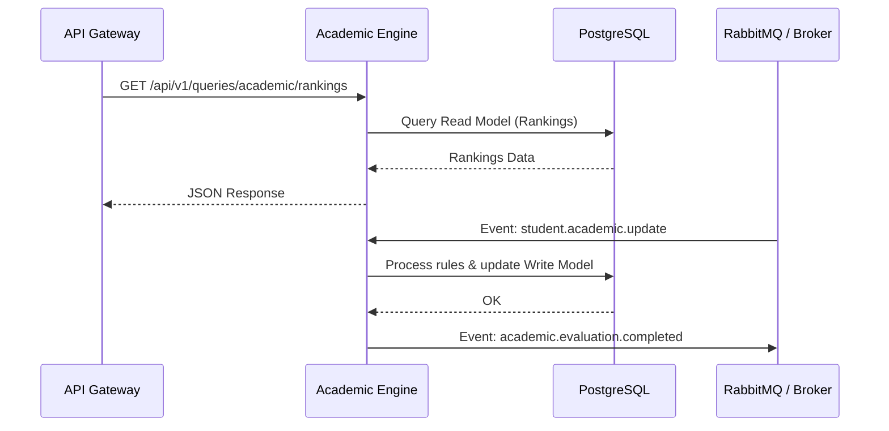
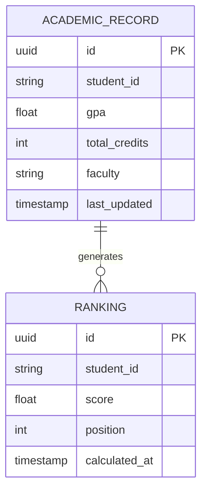

# Academic Engine

## Overview
The Academic Engine is a high-performance Go-based microservice responsible for calculating and evaluating a student's academic metrics (GPA, credits, faculty rules) against scholarship requirements. It acts as the core rules engine of the Scholarship System Platform.

## What it does
- Validates academic history against strict university regulations.
- Generates dynamic rankings for scholarships based on GPAs and earned credits.
- Provides extremely fast, concurrent calculations using Goroutines.
- Integrates with the workflow orchestrator (via Message Broker) to approve or reject academic phases of applications.

## How to use it
1. **Prerequisites**: Go 1.21+, PostgreSQL, RabbitMQ.
2. **Fetch Dependencies**:
   ```bash
   go mod download
   ```
3. **Run locally**:
   Set required environment variables (`DB_HOST`, `DB_USER`, `DB_PASSWORD`, `RABBITMQ_URL`) and run:
   ```bash
   go run cmd/main.go
   ```
4. **Run tests & benchmarks**:
   ```bash
   go test ./...
   go test -bench=. ./benchmarks/...
   ```

## Architecture & Workflow

The Engine uses a CQRS pattern with Domain-Driven Design (DDD).



## Database Schema


