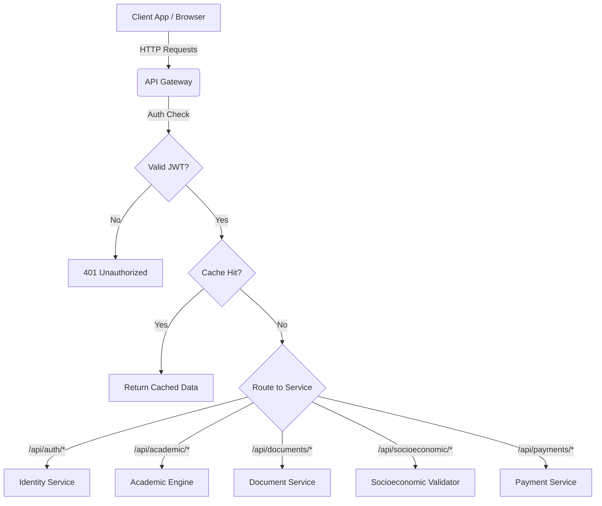

# API Gateway

## Overview
The API Gateway acts as the single entry point for the Scholarship System Platform. It routes client requests (from the Student Portal and Admin Dashboard) to the appropriate internal microservices, handling cross-cutting concerns like authentication, rate limiting, and caching.

## What it does
- **Routing**: Proxies traffic to Identity, Academic, Document, Socioeconomic, and Payment services.
- **Security**: Validates JWT tokens using public keys before forwarding requests to protected endpoints.
- **Performance**: Uses Redis to cache frequent read queries (e.g., rankings, public announcements).
- **Load Balancing**: Distributes load across internal service instances.

## How to use it
1. **Prerequisites**: Node.js 20+, Redis.
2. **Install Dependencies**:
   ```bash
   npm install
   ```
3. **Configuration**: Set environment variables for downstream services (`IDENTITY_SERVICE_URL`, `ACADEMIC_SERVICE_URL`, etc.).
4. **Run locally**:
   ```bash
   npm run start:dev
   ```

## Architecture & Workflow



## Database
The API Gateway does not use a persistent relational database. It relies on **Redis** for ephemeral caching and rate limiting.
