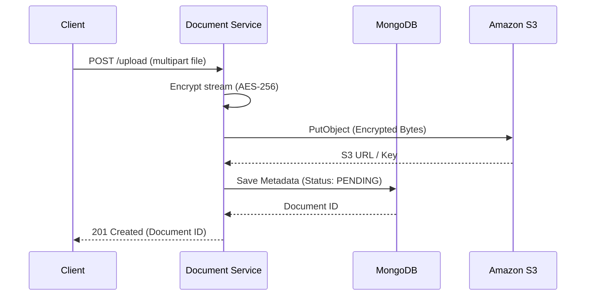
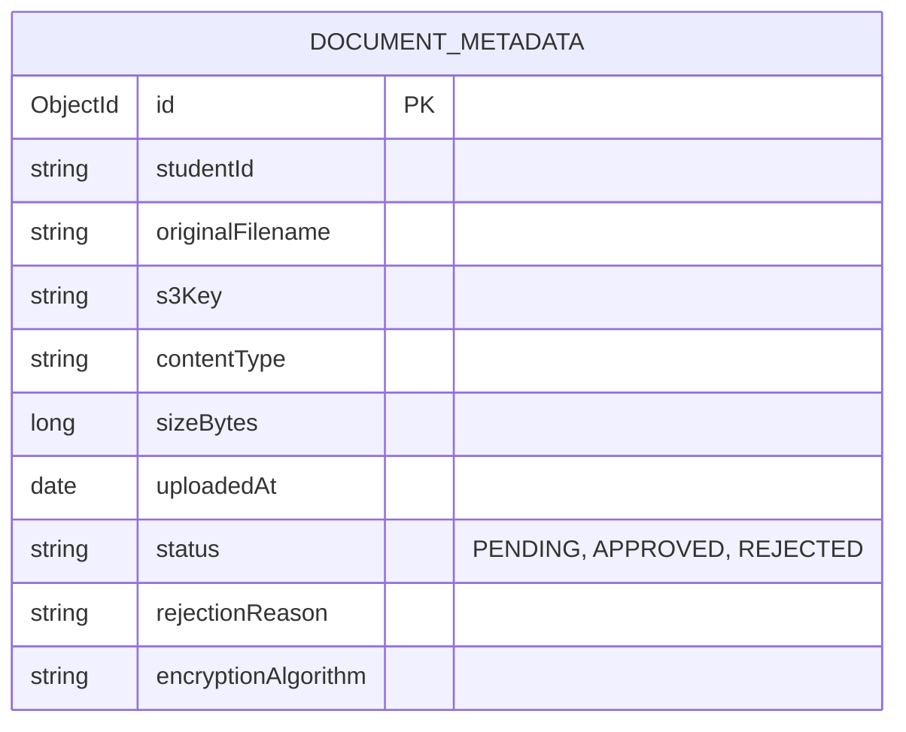

# Document Service

## Overview
The Document Service is a Spring Boot microservice responsible for the secure storage, retrieval, and verification of sensitive student documents (e.g., transcripts, ID cards, financial records). It acts as the central document repository for the Scholarship System Platform.

## What it does
- **Storage**: Uploads binary document files directly to Amazon S3.
- **Security**: Encrypts all files using AES-256-CBC before transmission to S3, ensuring zero-knowledge storage at rest.
- **Metadata Management**: Stores document metadata (upload date, status, verification results) in MongoDB.
- **Orchestration**: Listens to RabbitMQ for verification requests from the admin dashboard or other microservices.

## How to use it
1. **Prerequisites**: Java 17+, Maven, MongoDB, AWS S3 Bucket, RabbitMQ.
2. **Configuration**:
   Requires the following environment variables: `MONGO_URI`, `S3_BUCKET_NAME`, `AES_SECRET_KEY`, `AWS_ACCESS_KEY_ID`, `AWS_SECRET_ACCESS_KEY`, `AWS_SESSION_TOKEN` (optional for temporary creds).
3. **Build & Run locally**:
   ```bash
   ./mvnw clean package
   java -jar target/document-service.jar
   ```

## Document Handling & Uploads
To upload a document:
1. Obtain a valid JWT token.
2. Make a `multipart/form-data` POST request to `/api/documents/upload`.
3. Include the file in the `file` field and any metadata in the form body.
4. The service will generate a UUID, encrypt the stream, upload to S3, and save the metadata to MongoDB.

## Architecture & Workflow



## Database Schema


