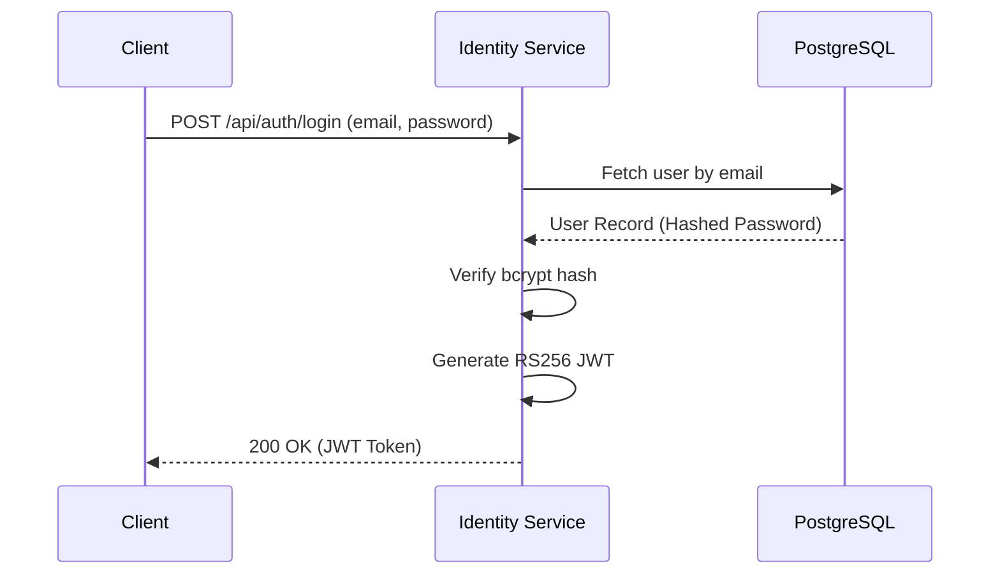
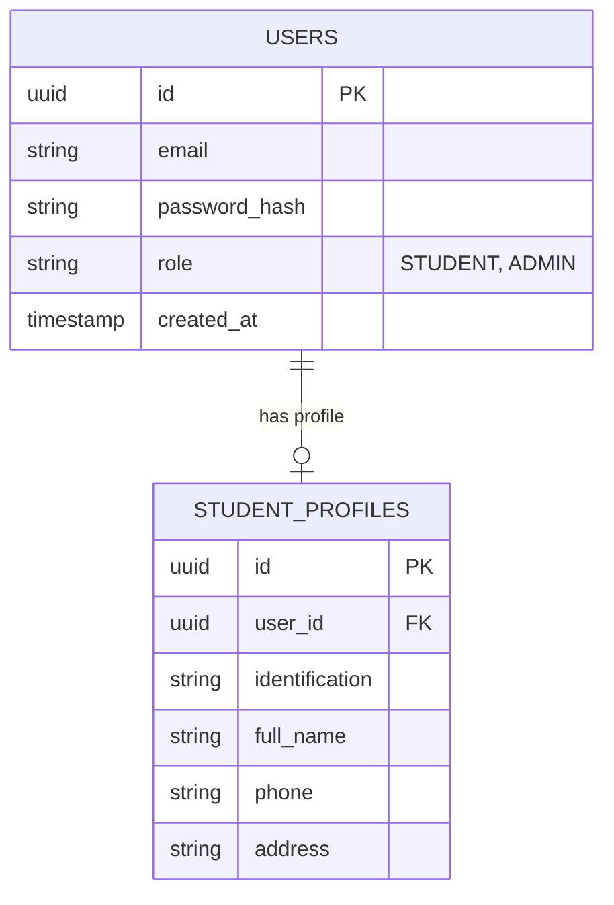

# Identity Service

## Overview
The Identity Service is a NestJS-based microservice that manages student authentication, authorization, and core profile data. It acts as the identity provider for the entire Scholarship System Platform.

## What it does
- **Authentication**: Issues securely signed JSON Web Tokens (JWT) using RS256 (asymmetric keys).
- **Authorization**: Manages user roles (e.g., `STUDENT`, `ADMIN`) to restrict access.
- **Profile Management**: Handles student biographical data and credentials.
- **Bulk Ingestion**: Provides high-throughput endpoints for creating thousands of student records simultaneously from Excel/CSV uploads.

## How to use it
1. **Prerequisites**: Node.js 20+, PostgreSQL.
2. **Install Dependencies**:
   ```bash
   npm install
   ```
3. **Configuration**:
   Requires `DB_HOST`, `DB_PORT`, `DB_USERNAME`, `DB_PASSWORD`, `DB_NAME`, `JWT_PRIVATE_KEY`, and `JWT_PUBLIC_KEY`.
4. **Run locally**:
   ```bash
   npm run start:dev
   ```
5. **Run tests**:
   ```bash
   npm run test
   ```

## Architecture & Workflow



## Database Schema


