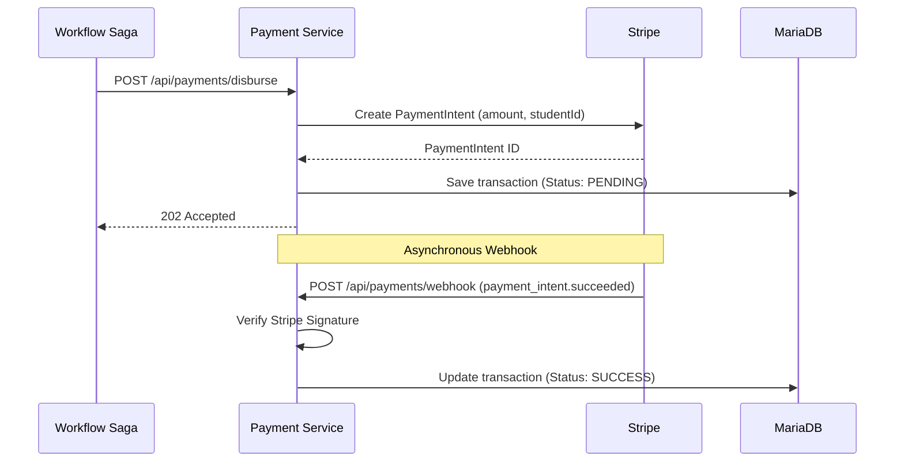
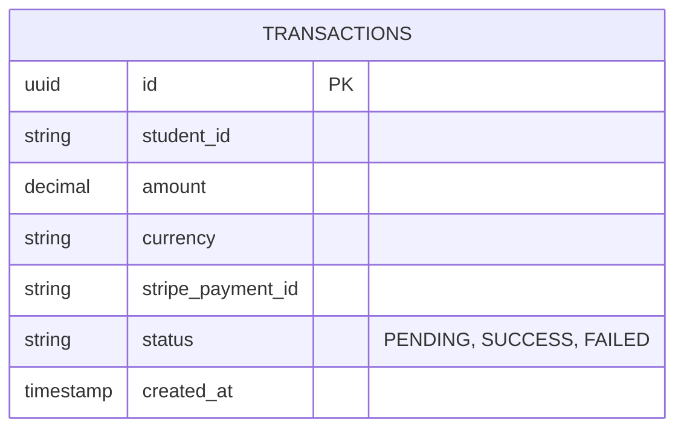

# Payment Service

## Overview
The Payment Service is a NestJS microservice responsible for processing scholarship disbursements and validating financial transactions. It integrates directly with Stripe to simulate secure, verifiable payouts to students.

## What it does
- **Payment Processing**: Initiates and records payouts to approved scholarship recipients.
- **Stripe Integration**: Generates PaymentIntents and listens to Stripe Webhooks for asynchronous payment status updates.
- **Ledger**: Maintains an immutable ledger of all transactions in a relational database.

## How to use it
1. **Prerequisites**: Node.js 20+, MariaDB, Stripe CLI (for testing webhooks).
2. **Install Dependencies**:
   ```bash
   npm install
   ```
3. **Configuration**:
   Requires `DB_HOST`, `DB_USER`, `DB_PASSWORD`, `DB_NAME`, `STRIPE_SECRET_KEY`, and `STRIPE_WEBHOOK_SECRET`.
4. **Run locally**:
   ```bash
   npm run start:dev
   ```
5. **Run tests**:
   ```bash
   npm run test
   ```

## Architecture & Workflow



## Database Schema


