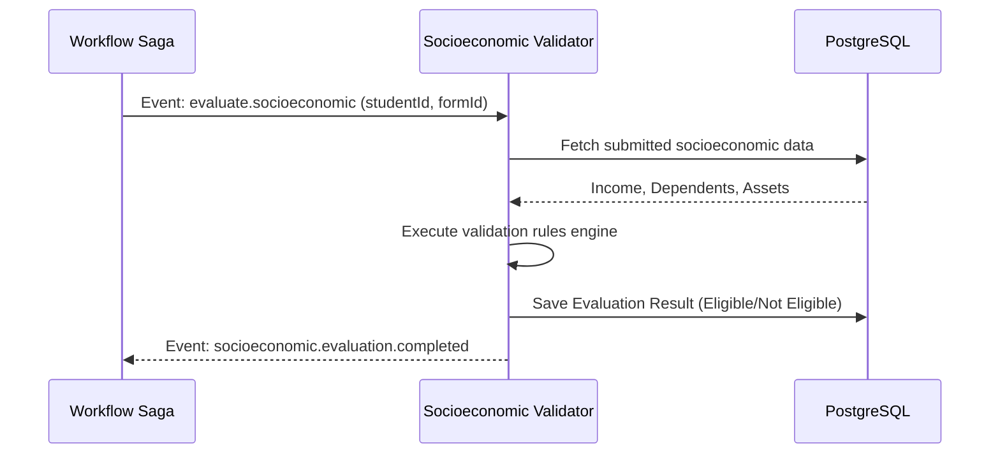
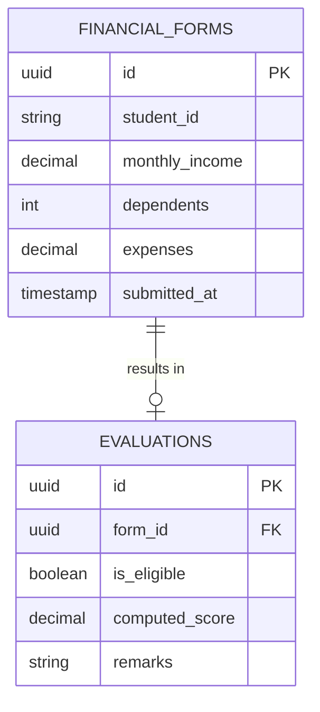

# Socioeconomic Validator

## Overview
The Socioeconomic Validator is a Java Spring Boot microservice responsible for assessing a student's financial situation. It processes income, dependents, and other socioeconomic factors to determine eligibility for need-based scholarships.

## What it does
- **Financial Assessment**: Evaluates submitted financial forms against predefined poverty lines or university-specific scholarship thresholds.
- **Data Validation**: Cross-checks data consistency (e.g., income vs. expenses, household size).
- **Asynchronous Processing**: Listens to the workflow orchestrator (Saga) via Message Broker to validate applications as part of the overarching scholarship approval process.

## How to use it
1. **Prerequisites**: Java 17+, PostgreSQL, RabbitMQ/Kafka.
2. **Configuration**:
   Requires `SPRING_DATASOURCE_URL`, `SPRING_DATASOURCE_USERNAME`, `SPRING_DATASOURCE_PASSWORD`, and Broker credentials.
3. **Run locally**:
   ```bash
   java -jar target/socioeconomic-validator-0.0.1-SNAPSHOT.jar
   ```

## Architecture & Workflow



## Database Schema


