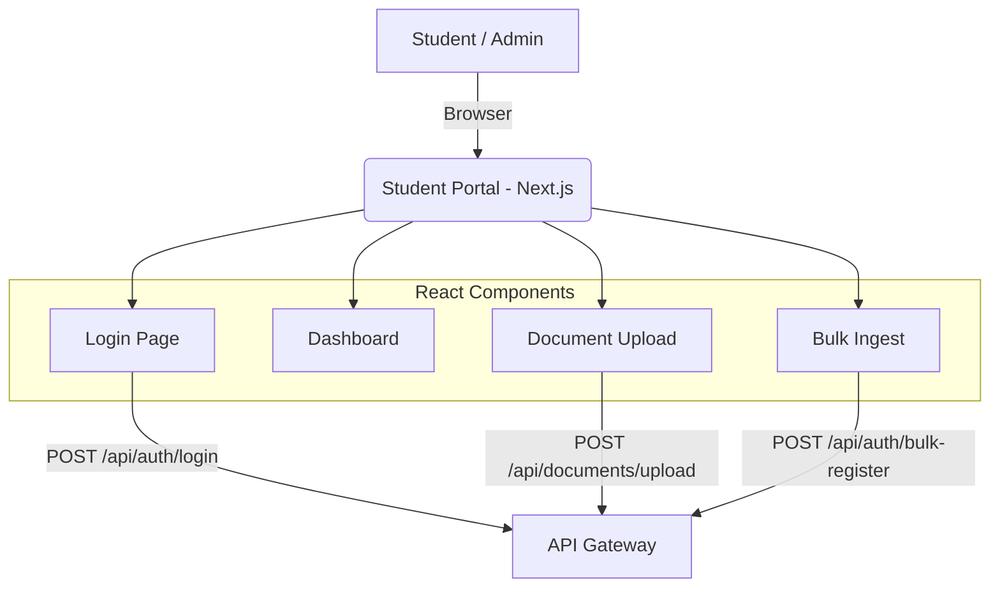

# Student Portal

## Overview
The Student Portal is the user-facing web frontend built with Next.js and React. It serves as the primary interface for students to apply for scholarships, upload required documents, view their application status, and check academic rankings. 

It also includes an Admin dashboard for university staff to manage bulk student ingestions and review applications.

## What it does
- **Authentication**: Provides login/logout flows and securely stores JWTs.
- **Application Flow**: Guides students step-by-step through scholarship applications.
- **Document Uploads**: Provides a UI for students to upload PDFs and images, interacting with the API Gateway (which routes to Document Service).
- **Admin Tools**: Allows administrators to upload Excel/CSV files for bulk student profile creation and evaluate pending documents.

## How to use it
1. **Prerequisites**: Node.js 20+.
2. **Install Dependencies**:
   ```bash
   npm install
   ```
3. **Configuration**:
   Create a `.env.local` file and set the API Gateway URL:
   ```env
   NEXT_PUBLIC_API_URL=http://localhost:3000
   ```
4. **Run locally**:
   ```bash
   npm run dev
   ```
   The portal will be accessible at `http://localhost:3001`.

## Architecture & Workflow



## State Management
The portal uses React Context and React Query (TanStack Query) for efficient data fetching, caching, and state synchronization with the backend APIs.
