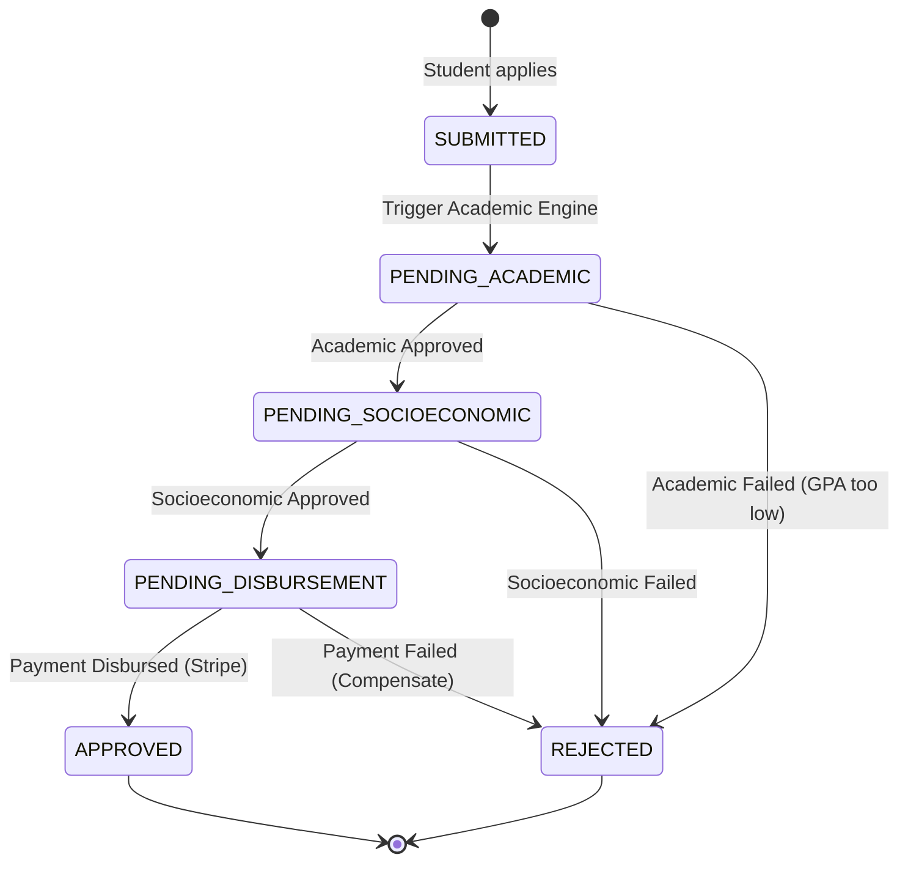

# Workflow Saga

## Overview
The Workflow Saga is a Java-based microservice that acts as the central orchestrator for the Scholarship System Platform. It implements the Saga Pattern to manage distributed transactions across the various microservices without relying on a single distributed database.

## What it does
- **State Machine Orchestration**: Tracks the overarching state of a scholarship application (e.g., PENDING_ACADEMIC, PENDING_SOCIOECONOMIC, PENDING_DISBURSEMENT, APPROVED, REJECTED).
- **Event Choreography/Orchestration**: Listens to and emits events via Kafka/RabbitMQ to trigger downstream validations in other microservices.
- **Compensating Transactions**: If any step fails (e.g., the student is not socioeconomically eligible), the Saga issues compensating events to roll back previous states (e.g., cancelling the pending application).

## How to use it
1. **Prerequisites**: Java 17+, Redis (for state persistence), Kafka/RabbitMQ.
2. **Configuration**:
   Requires `REDIS_HOST`, `REDIS_PORT`, and `KAFKA_BROKERS` to be set.
3. **Run locally**:
   ```bash
   ./mvnw clean package
   java -jar target/workflow-saga-0.0.1-SNAPSHOT.jar
   ```

## Architecture & Workflow



## Database Schema
The Workflow Saga does not use a traditional relational database. It relies heavily on **Redis** for high-speed state machine persistence, allowing it to rapidly resume sagas upon receiving asynchronous event replies.
