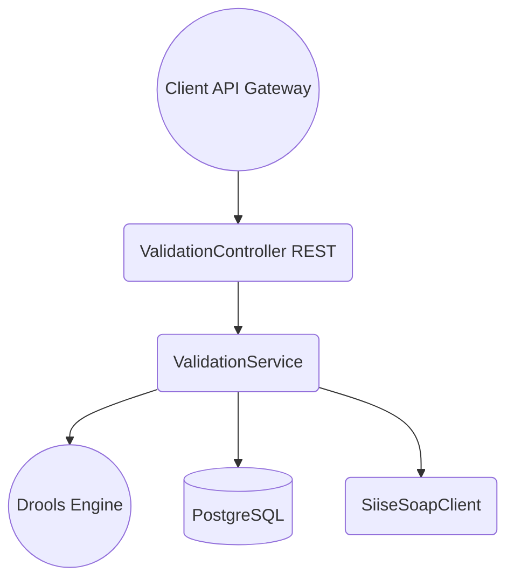
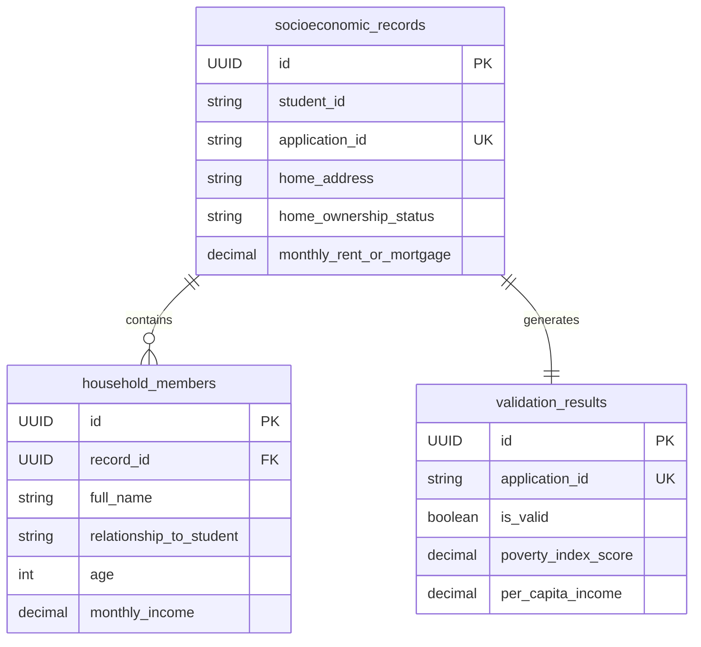
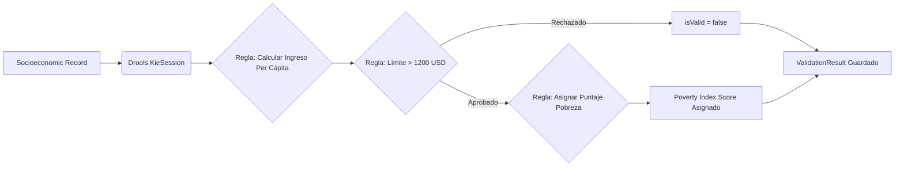
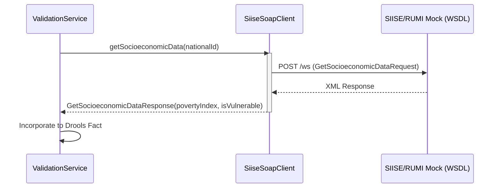

# Evidencias Sprint 4 (S4) - Dominio Socioeconómico

Este documento contiene las capturas (diagramas) y descripciones detalladas de los entregables del Sprint 4 para ser adjuntadas como comentarios en los respectivos tickets de Jira.

---

## SS-24 Crear Socioeconomic Validator en Java/Spring

**Descripción para Jira:**
Se ha creado desde cero el microservicio `socioeconomic-validator` utilizando Java 17 y Spring Boot 3.2.4. La arquitectura interna sigue un patrón de capas acoplado con un motor de reglas para la lógica de validación, garantizando alta cohesión y bajo acoplamiento (Principios SOLID). Se ha configurado el `pom.xml` con las dependencias de JPA, PostgreSQL, Drools y Web Services, y se ha dockerizado el servicio a través de su respectivo `Dockerfile` expuesto en el puerto 8082. Además, se expuso el endpoint REST `POST /api/socioeconomic/validate`.

**Captura / Diagrama de Arquitectura:**

---

## SS-27 Diseñar esquema PostgreSQL en 3NF

**Descripción para Jira:**
Se diseñó e implementó el esquema de base de datos relacional para el microservicio socioeconómico utilizando PostgreSQL. Para garantizar la trazabilidad y control de versiones de la base de datos, se utilizó Flyway (`V1__init_schema.sql`). El esquema está normalizado en Tercera Forma Normal (3NF) para eliminar dependencias transitivas. Las tablas principales incluyen `socioeconomic_records`, `household_members` (relación 1 a N) y `validation_results`. Posteriormente, este esquema se mapeó a entidades JPA con Hibernate.

**Captura / Esquema Entidad-Relación (3NF):**

---

## SS-25 Configurar motor de reglas DroolsLite

**Descripción para Jira:**
Para asegurar que las reglas socioeconómicas (que cambian frecuentemente según las leyes) no estén hardcodeadas en la lógica de negocio, se integró el motor de reglas de JBoss Drools (`drools-core`). Se creó el archivo de reglas `socioeconomic.drl` el cual define la lógica declarativa para calcular el ingreso per cápita de la familia y asignar el puntaje de pobreza (Poverty Index Score). El servicio de Spring inyecta la sesión de KieContainer y ejecuta dinámicamente el `fireAllRules()`.

**Captura / Lógica del Motor de Reglas:**

---

## SS-26 Desarrollar stub SOAP para SIISE/RUMI

**Descripción para Jira:**
Debido a la indisponibilidad actual de los servicios externos gubernamentales, se procedió a construir un Stub y Mock del servicio web SOAP para el sistema SIISE/RUMI. Se construyó el contrato `siise.wsdl` manualmente, y se utilizó la configuración de Spring Web Services (`Jaxb2Marshaller`, `WebServiceGatewaySupport`) para generar el cliente `SiiseSoapClient`. Este cliente permite consultar de manera asíncrona/síncrona el índice de vulnerabilidad mediante la cédula del aplicante, aislando la lógica mediante el patrón Adapter.

**Captura / Integración SOAP:**

