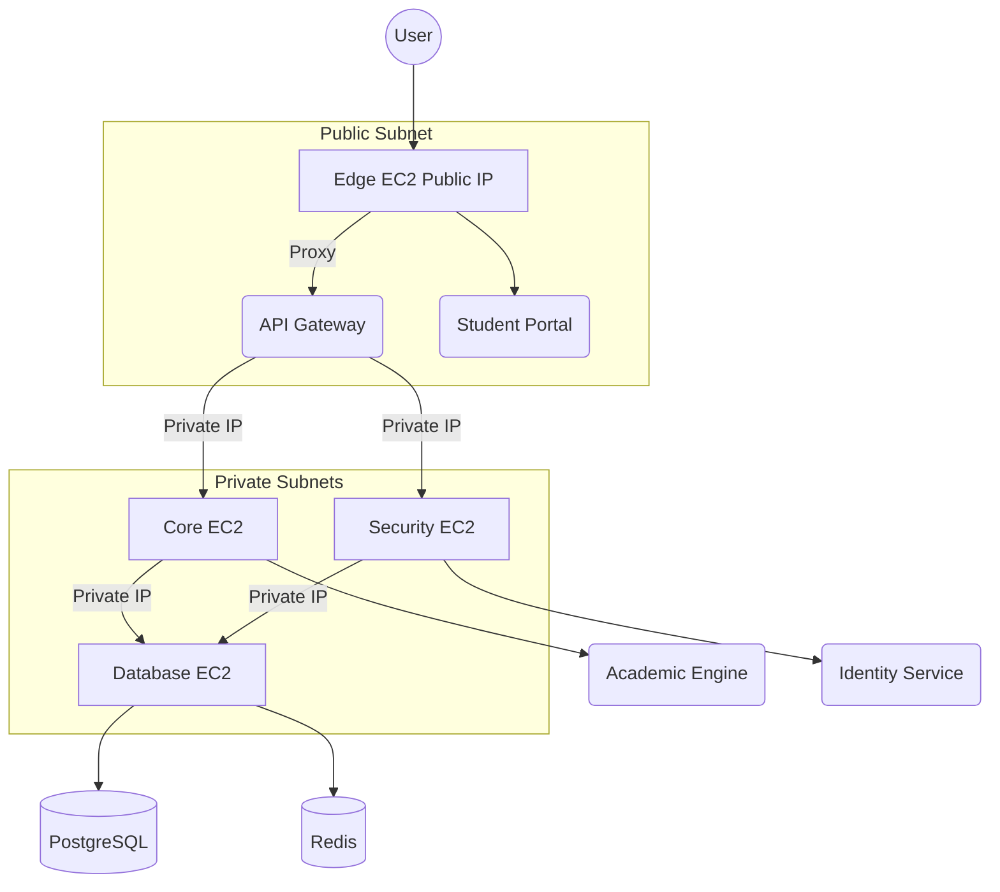

# Multi-Node Deployment Refactor

We successfully refactored the CI/CD pipeline to deploy the microservices automatically to their designated EC2 instances.

## What Changed?

1. **Split Compose Files:**
   The monolithic `docker-compose.prod.yml` was deleted and replaced by 4 smaller files inside the `deployment/compose/` directory:
   - `edge.yml`: Gateway & Student Portal
   - `core.yml`: Academic Engine
   - `security.yml`: Identity Service
   - `database.yml`: Postgres & Redis

2. **Automated Infrastructure Discovery:**
   The `cd-apps.yml` pipeline now runs `terraform init` and `terraform output` on the fly to fetch the private IPs (`CORE_PRIVATE_IP`, `SECURITY_PRIVATE_IP`, `DATABASE_PRIVATE_IP`) that Terraform created.

3. **Bastion SSH Deployment:**
   Because only the Edge node has a public IP, the GitHub Action logs into the Edge node, transfers the SSH keys to it, and then uses the Edge node to `ssh` into the internal nodes and run the corresponding `docker-compose` commands.

## Architecture

## How to Verify
When you merge this PR to the `QA` branch, monitor the GitHub Actions run for `Deploy to QA`. You should see the script successfully finding the private IPs, copying the files, and spinning up the containers across the 4 different nodes.
